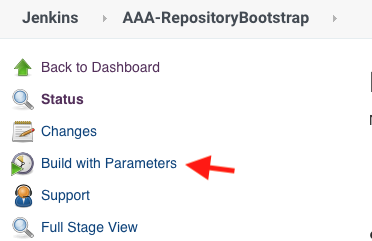
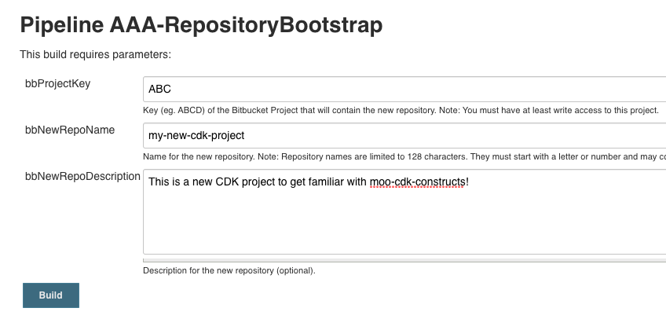
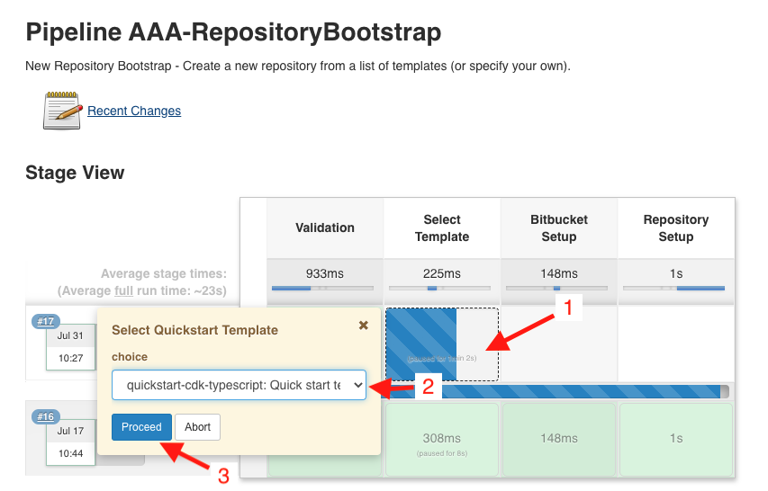
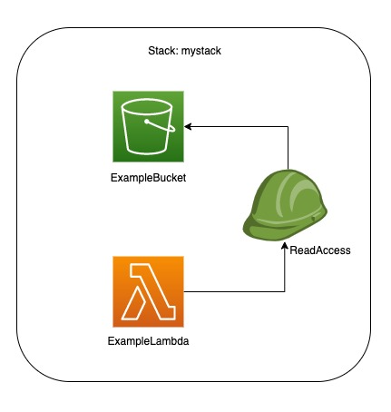

# Table of contents

1. [Bootstrap this project](#bootstrap)
1. [Required Node Version](#nodeversion)
1. [Post Bootstrap](#post)
1. [Quickstart Architecture](#arch)
1. [Quickstart for Typescript Guide](#guide)
1. [FAQ](#faq)
1. [Reference Material](#reference)


<a name="bootstrap"></a>
# Bootstrap this project into Jenkins & bitbucket

**WARNING** do not fork this project. Instead, use the Jenkins bootstrap process outlined below to create a 
bitbucket repo with this code copied in and also configure your Jenkins pipeline.

Quickly create a new Bitbucket repository with the code from this quickstart in your Bitbucket project with the RepositoryBootstrap!

Navigate to Jenkins AAA-RepositoryBootstrap job
https://jenkinsci.mutualofomaha.com/jenkins/job/AAA-RepositoryBootstrap/



Enter your bitbucket project key, the name you want for the new repository, and a description.

Click Build to continue



Next you need to select the quickstart template to copy from



To use this project select `quickstart-cdk-typescript`

Click Proceed

If your build succeeds then you should see your new repository in your new Bitbucket project!  


<a name="nodeversion"></a>
# Required Node Version
esbuild has been used rather than webpack

Require node 12.21 or later


<a name="post"></a>
# Post Bootstrap Steps
1. Update to the latest @moo-cdk version and matching @aws-cdk & constructs package version. 
   - Get latest @moo-cdk version: https://bitbucket.mutualofomaha.com/projects/AWS_CDK/repos/moo-cdk-constructs/browse/CHANGELOG.md
   - Determine corresponding @aws-cdk and constructs version: https://confluence.mutualofomaha.com/confluence/display/PC/moo-cdk-constructs+Version+Matrix
   - Update [package.json](package.json), setting correct version for all `@moo-cdk/*`, `@aws-cdk/*` & `constructs` packages

3. Modify [bin/app.ts](bin/app.ts)

   The projectProps are populated with dummy values. Update these props with the correct information for your project
      ```typescript
      const projectProps: MooStackProps = {
         asiName: "abc",
         environmentName: EnvironmentName.SBX,
         projectName: "quickstart-cdk-typescript"
      };
      ```

4. Modify the package name and description in  [package.json](package.json)
    ```json
      {
        "name": "quickstart-cdk-typescript",
        "description": "A quickstart for bootstrapping CDK projects in Typescript",
      }
    ```

5. Modify the [Jenkinsfile](Jenkinsfile)

   The `Jenkinsfile` is configured to deploy to the DOC team's sandbox for functional testing. You'll need to 
   update each deployment step with the proper aws account (target) and env
    ```groovy
    // replace the target and env with the correct deployment information
    nodeCdkDeployStage(target: "doc-sandbox", env: "sbx")
    //nodeCdkDeployStage(target: "xxx-dev", env: "dev")
    //nodeCdkDeployStage(target: "xxx-cat", env: "cat")
    //nodeCdkDeployStage(target: "xxx-prod", env: "prod")
    ```

6. Authorize your deployments into AWS

   Your new project is likely not yet "authorized" to deploy to your AWS accounts. Please see the 
   [Aws Deployment Authorization](https://confluence.mutualofomaha.com/confluence/display/CTPART/AWS+Deployment+Authorization+Service+-+Request+Process)
   documentation for more information
   
7. Read the [documentation](#reference) about cdk

8. Delete the [img](img) directory and replace this README with something useful for your project!

<a name="arch"></a>
# Quickstart Architecture



<a name="guide"></a>
# Quickstart CDK Typescript Guide

## Useful commands

* `yarn build` - production compile typescript to js
* `yarn build:dev` - development compile typescript to js and include dev tooling
* `yarn watch` - watch for changes and bundle/compile with esbuild/tsc in parallel
* `yarn debug:example-lambda` - attach a debugger and locally invoke example lambda, requires sam cli setup
* `yarn test` - perform the jest unit tests
* `yarn test -u` - perform the jest unit tests and update the stack snapshots
* `yarn clean` - remove all the compiled objects from the project
* `yarn lint` - lint all the ts files in the project
* `yarn lint --fix` - fix any linting errors that can be automatically fixed
* `yarn cdk synth` - emits the synthesized CloudFormation template
* `yarn cdk diff` - compare deployed stack with current state
* `yarn cdk deploy` - manually deploy this stack to an AWS account/region. Requires aws creds in your shell 
  **Note:** class 2 & 1 deployments should use the Jenkins pipeline

## Project structure
- [cdk.json](cdk.json) - this file tells the cdk cli command where to find the app
- [bin/app.ts](bin/app.ts) - this is the main entrypoint for the app - where the app and stacks are defined
- [lib/stacks](lib/stacks) - this is where the cdk stacks are defined. Usually one MooStack class per file
- [lib/functions](lib/functions) - this is where lambda function code is stored. This directory is webpacked into `dist/bundled`
- [test/](test) - this is where unit tests are stored. Directory structure should typically match lib. test files are called xx.test.ts
- [cdk.out/](cdk.out) - this is where the compiled cdk cloudformation and assets will be generated
- [dist/](dist) - this is where the compiled typescript and webpack files will be stored

<a name="faq"></a>
# FAQ

### 1. My build fails. Or my IDE is getting errors
It is critical that all @moo-cdk versions be at the same version, and that they be in sync with the @aws-cdk version, and 
the constructs package version. This does not mean that they will all be the *same* version, but that they must be 
coordinated versions. 
See the [Moo Cdk Version Matrix](https://confluence.mutualofomaha.com/confluence/display/PC/moo-cdk-constructs+Version+Matrix)
document for information about what matching versions. Look at your [package.json](package.json) or use `yarn list`
to see versions of installed packages

### 2. How can I debug Jenkins build problems locally?
Sometimes failures occur in the pipeline that do not happen locally. This is often because the runtime environment
in Jenkins differs slightly from that of your desktop environment. You can run build commands inside a Docker
container that is exactly the same as the pipeline uses to debug build errors. 

1. Get a shell in a docker container that mounts your project to /local
  `docker run -it -v $(pwd):/local -w="/local" $(docker pull -q repo.mutualofomaha.com:5003/com.mutualofomaha.aws_cdk/node12-alpine:latest) /bin/sh`

2. Run yarn commands as desired inside the build container
  `yarn test`
   
### 3. How are the lambdas bundled?
Lambdas can be built by running `yarn build`. The build task accomplishes the following using [esbuild](https://github.com/evanw/esbuild), see [configuration](build.config.mjs).

- Each file in `lib/functions` ending in `.ts` or `.js` (Lambda Entry Point) is bundled as it's own folder inside of `/dist/bundled`. 
- Example: `functions/hello-world.ts` -> `dist/bundled/hello-world/hello-world.js`
- Some dependencies are excluded from the bundle:
  - `aws-sdk`
  - `aws-lambda`
  - `commonjs2`
  - Any peerDependencies defined in [package.json](package.json)

### 4. How do I debug lambda locally?
Lambda can be invoked and debugged locally by running `yarn debug:*` tasks. This requires a local installation 
of [sam-cli](https://docs.aws.amazon.com/serverless-application-model/latest/developerguide/serverless-sam-cli-install.html) 
and [sam-beta-cdk](https://docs.aws.amazon.com/serverless-application-model/latest/developerguide/serverless-cdk-getting-started.html). 
SAM CLI is used to emulate both Lambda and API Gateway locally. See [cli reference](https://docs.aws.amazon.com/serverless-application-model/latest/developerguide/serverless-sam-cli-command-reference.html) - 
useful sub commands include [local invoke](https://docs.aws.amazon.com/serverless-application-model/latest/developerguide/sam-cli-command-reference-sam-local-invoke.html), 
[local generate-event](https://docs.aws.amazon.com/serverless-application-model/latest/developerguide/sam-cli-command-reference-sam-local-generate-event.html), 
and [local start api](https://docs.aws.amazon.com/serverless-application-model/latest/developerguide/sam-cli-command-reference-sam-local-start-api.html). 
Starting api gateway has issues with MoO constructs, further research or workarounds is needed in this area.

1. Change the aws profile in your terminal to the account you are targeting. This can be done with 
`aws configure` or setting aws environment variables from the account `Command line or programmatic access` 
login screen.

2. Open the [env.json](env.json) file and populate the required environment variables for the lambda 
resource. Most env values change depending on where your profile is set. Make sure to log into the aws 
console to retrieve the appropriate dependency references for your environment. When you are done 
testing make sure you set account id properties back to a masked dummy value, so the real value is 
not pushed to source control.

3. View or modify the event payload [example-lambda.json](test/events/example-lambda.json). Use 
[local generate-event](https://docs.aws.amazon.com/serverless-application-model/latest/developerguide/sam-cli-command-reference-sam-local-generate-event.html) 
cli command to scaffold events for a wide variety of aws services like api gateway, dynamodb, kinesis, 
s3, sns, sqs, and step functions. Example events can be retrieved from cloudwatch logging and added to 
the `test/events` folder. This can be useful to recreate bugs from higher environments and replay/step through locally.

4. Configure the MooFunction(s) to have an `environment` var: `NODE_EXTRA_CA_CERTS: ""` set to an empty string.
   `NODE_EXTRA_CA_CERTS` is required for locally testing the lambda via SAM. Setting to an empty string has no
   effect on deployments to AWS, so it can remain set as is. However, if SAM isn't used, this can be removed.
   example MooFunction:
   ```
    const mooFn = new MooFunction(this, "ExampleLambda", {
      code: Code.fromAsset(path.resolve(__dirname, "../../dist/bundled/example-lambda")),
      handler: "example-lambda.handler",
      runtime: Runtime.NODEJS_14_X,
      environment: {
        // NODE_EXTRA_CA_CERTS is required for locally testing the lambda via SAM. Setting to an empty string has no
        // effect on deployments to AWS, so it can remain set as is. However, if SAM isn't used, this can be removed
        NODE_EXTRA_CA_CERTS: "",
        NODE_OPTIONS: "--enable-source-maps"
      }
    });
   ```

5. Run the debug task `yarn debug:example-lambda`. The sam cli beta binary `sam-beta-cdk` will 
automatically synthesize the cdk app when it starts. If you are actively developing a lambda function, 
keep a separate `yarn watch` terminal open to automatically bundle the lambda as you make code changes. 

6. Attach a debugger in your IDE. See VS Code debug configurations for `Attach to SAM CLI` runner 
in [.vscode/launch.json](.vscode/launch.json). Make sure docker is installed and running on your machine. 
A remote debugging session will execute and stop on entry in lambda's runtime. Play through the first 
breakpoint to see logs from your locally invoked lambda function.


<a name="reference"></a>
# Reference Material

* MoO CDK Constructs
  * [Typescript Consumer Guide (Start Here)](https://bitbucket.mutualofomaha.com/projects/AWS_CDK/repos/moo-cdk-constructs/browse/docs/npm.md)
  * [Best Practices](https://bitbucket.mutualofomaha.com/projects/AWS_CDK/repos/moo-cdk-constructs/browse/docs/consumers.md)
  * [Moo Approved AWS Services and NFRs](https://confluence.mutualofomaha.com/confluence/display/PC/AWS+Service+CDK+Constructs)
  * [API Documentation](https://bitbucket.mutualofomaha.com/projects/AWS_CDK/repos/moo-cdk-constructs/browse/docs/api/README.md)
  * [Source Code](https://bitbucket.mutualofomaha.com/projects/AWS_CDK/repos/moo-cdk-constructs/browse)
* AWS CDK
  * [Developer Guide](https://docs.aws.amazon.com/cdk/latest/guide/home.html)
  * [API Reference](https://docs.aws.amazon.com/cdk/api/latest/docs/aws-construct-library.html)
  * [Workshops](https://cdkworkshop.com/)
  * [Examples](https://github.com/aws-samples/aws-cdk-examples)
  * [Source Code](https://github.com/aws/aws-cdk)
* AWS Deployment Authorization
  * [Request Process](https://confluence.mutualofomaha.com/confluence/display/CTPART/AWS+Deployment+Authorization+Service+-+Request+Process)
* Tools/Libraries
  * [Jenkins Pipeline Shared Library](https://bitbucket.mutualofomaha.com/projects/DCI/repos/pipeline-shared-lib/browse/docs/vars/README.md)
  * [AWS Config Check (aws-config-check)](https://bitbucket.mutualofomaha.com/projects/AWS_CDK/repos/aws-config-check/browse)
  * [AWS CloudFormation Limit Check (aws-cft-check)](https://bitbucket.mutualofomaha.com/projects/AWS_CDK/repos/aws-cft-check/browse)
* Other
  * [Awesome CDK - Curated list of awesome AWS CDK open-source projects, guides, blogs and other resources](https://github.com/kolomied/awesome-cdk)
